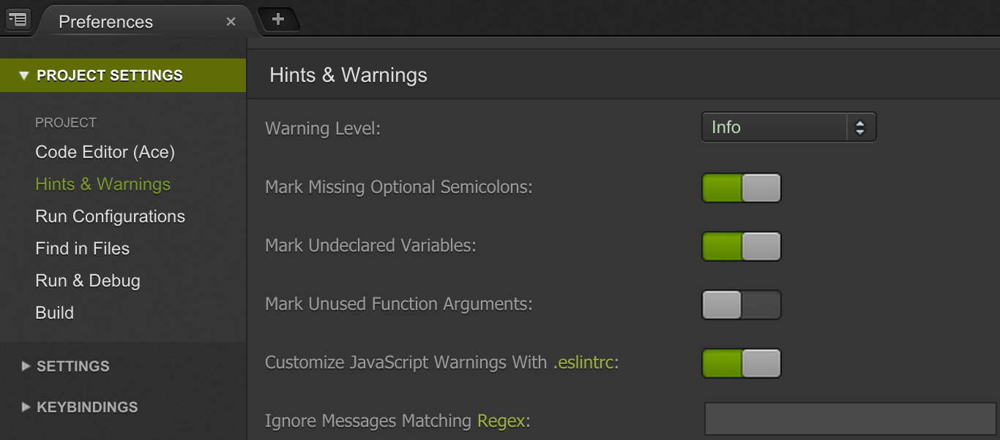

# Cloud9 Code Editor

Cloud based code editors are winning the tools race against their desktop based counterparts. 

## Advantages of Cloud based editors

There are seven distinct advantages of Cloud based editors.

1. Docker based containers for your editor environment means lesser pain provisioning a developer box.

2. Choice of containers pre-installed with target development environments including NodeJS.

3. Speed of installing remote libraries, updating from GitHub, deploying from Cloud to Cloud.

4. Pick up code editing from any machine even on a low bandwidth connection.

5. Scaling container storage, compute, and memory depending on project needs.

6. Starting from free, cost scales as your project needs scale.

7. Online staging, testing, and demo environment that you can share with customers and team.

## Reasons for choosing Cloud9

Over and above the advantages mentioned in previous section, Cloud9 offers more.

- Well documented features covering development scenarios in popular target platforms. See [Cloud9 docs](https://docs.c9.io/docs/). 

- Powerful code editor with theme-ready color coding for most popular languages.

- Reasonable pricing plan and generous trial period.

- Performance while code editing, searching, low bandwidth or mobile connections, updating remote source.

## Rapid app workflow in Cloud9

Following these tips and tweaks saves significant time in developing web apps using Cloud9.

**Hints & Warnings:** You can tweak these to your requirements by opening C9 preferences. This will save you some time downstream when you build code. We will recommend JS lint as part of the build pipeline. This option helps you catch common issues while coding.



**Hide file pattern:** Under Settings > General > Tree & Navigate. Enable viewing and editing files of .* pattern like .gitignore and .eslintrc. Use following pattern instead.

```
*.pyc, __pycache__,.git
```

*[TODO] This section is in progress*
 
## Alternatives to Cloud9

Browser based code editing is a highly competitive space.

[Stackshare](http://stackshare.io/stackups/cloud9-ide-vs-nitrous-io-vs-koding) declares Cloud9 as a winner among Koding, and Nitrous.

*[TODO] This section is in progress*
