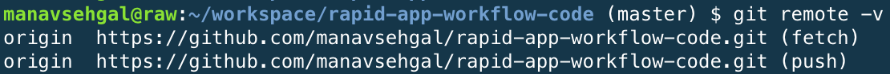

# Setup Web App Environment

Setting up the developer environment is one of the most crucial steps in your web app workflow. 

In this chapter we will achieve the following goals.

- Select an appropriate pre-installed container at Cloud9.
- Update node environment to latest releases.

## Environment assumptions

Our target platform is NodeJS. We are assuming you are running a developer box on Cloud9. Read more about [Cloud9 code editor](https://manavsehgal.gitbooks.io/rapid-app-workflow/content/cloud9_code_editor.html).

## Choose custom container

Start with a pre-configured container. Cloud9 offers choices of NodeJS, custom Ubuntu, HTML5, and Meteor stacks for NodeJS development.

We choose custom Ubuntu stack. This starts us with a blank file structure and basic target platform pre-installed.

## Check versions for Node environment

Check versions of NVM (Node Version Manager), NodeJS, and npm (Node Package Manager).

```
nvm --version && node --version && npm --version
```

This returns installed versions on our Cloud9 container as of this writing (2015 Oct).

```
0.24.1
v0.10.35
1.4.28
```

Check latest versions by visiting GitHub releases page for [NVM](https://github.com/creationix/nvm/releases), [NodeJS](https://github.com/nodejs/node/releases), and [NPM](https://github.com/npm/npm/releases).

## Upgrade node environment

As we found more current versions, we will start by updating NVM to latest. Follow [official nvm instructions](https://github.com/creationix/nvm#install-script) for updating using the install script. Note that the version ```v0.29.0``` mentioned here will change to latest release.

```
curl -o- https://raw.githubusercontent.com/creationix/nvm/v0.29.0/install.sh | bash
```

Next we follow [Cloud9 docs](https://docs.c9.io/docs/updating-nodejs) to update node using nvm.

```
nvm install 4.1.2
```

Your developer environment may have multiple versions of node installed. To ensure we always use the latest we run the following command.

```
nvm alias default 4.1.2
```

And the result.


We complete the node environment setup by updating npm. [npm GitHub issue](https://github.com/npm/npm/issues/1840) on the subject and [stackoverflow top answer](http://stackoverflow.com/questions/23393707/how-to-update-npm) suggest a solution for updating npm.

```
npm install npm -g
```

We check latest versions again as on 2015-Oct.

```
0.29.0
v4.1.2
3.3.6
```

Done! Our node environment is setup with latest versions.

**Note:** You will notice that node and npm major versions have jumped. This is because node is now following Semantic Versioning. [Official release](https://nodejs.org/en/blog/release/v4.0.0/) explains the significance of this change.

## Setup basic project structure

This section will help you setup your basic project structure. This will include Git version management and NPM dependency management. Each workflow specific chapter will add to this step as we add libraries and frameworks. What follows are the generic steps required for setting up the basic project structure.

### Setup Git

Cloud9 container comes pre-installed with Git, so all you need to do is clone your starter project from GitHub. Read [GitHub docs on how to setup on Linux](https://help.github.com/articles/set-up-git/#platform-linux).

To clone the RWA code repository.

```
git clone https://github.com/manavsehgal/rapid-app-workflow-code.git
```

You can also decide to [fork the repository](https://github.com/manavsehgal/rapid-app-workflow-code#fork-destination-box) and clone from your own copy.

If you plan to follow along and create your own project structure you can initialize a new git repository.

```
git init
```

It is a good idea to check remote repositories you will be fetching from or pushing changes to.

```
git remote -v
```

Results for RWA code will vary from yours depending on how you configure your local copy.



Once you make an changes pushing changes back to your copy of remote repository requires following steps.

```
git add --all
git commit -m "Commit log"
git push origin master
```

Learn more about how Git works and extend your knowledge of frequently used commands.

- [About Git](http://git-scm.com/about) from official website teaches you benefits and fundamentals of using Git.
- [Git cheatsheet (pdf)](https://training.github.com/kit/downloads/github-git-cheat-sheet.pdf) from GitHub explains frequently used commands.

### Initialize NPM

Initialize npm ```package.json``` file for saving project dependencies and version information.

```
npm init
```

This command creates a default ```package.json``` file.


## Test node environment

Let us develop a basic testing strategy for our new node environment.

- Hello World Node.js server and Node.js API features.
- [ES6 features](https://nodejs.org/en/docs/es6/) which Node.js now compiles by default. No run-time flags required.

### Hello world Node.js server

Create a file called ```server.js``` to test server features and Node.js API. 

**Note:** You can also skip this step in case you have cloned the RWA code repository from GitHub. It comes with a more updated version of each of the following samplers.

```javascript
// Adpated from: https://nodejs.org/en/about/

var http = require('http');

http.createServer(function (req, res) {
  res.writeHead(200, {'Content-Type': 'text/plain'});
  res.end('Hello World\n');
}).listen(8080, "0.0.0.0");

console.log('Server running at http://0.0.0.0:8080/');
```

Run the server.

```
node server
```

Success scenario will display the console log, a prompt from Cloud9, and "Hello World" when you browse to the url.


Hit ```CTRL+C``` in your terminal window to exit the server or close the terminal tab and open a new one.
 
### Default ES6 features

Create ```es6-default.js``` and copy following code.

```javascript
var myMap = new Map();
myMap.set(0, "zero"); myMap.set(1, "one");

console.log("Collections: Map");

myMap.forEach(function(value, key) {
  console.log(key + " = " + value);
}, myMap)

```

Run this ES6 sample.

```
node es6-default
```

Success if following result displays in console.

```
0 = zero
1 = one
```

*TODO: This section is in progress*
