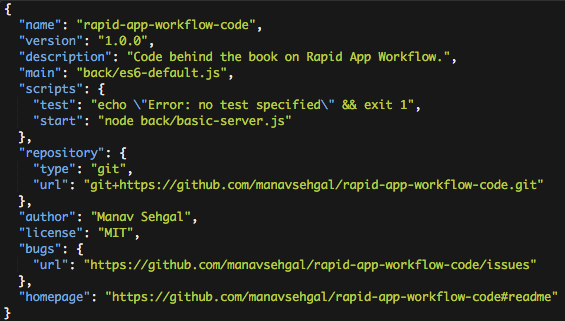

# Setup Web App Environment

Setting up the developer environment is one of the most crucial steps in your web app workflow. 

In this chapter we will achieve the following goals.

- Select an appropriate pre-installed container on Cloud9.
- Check and upgrade node environment.
- Setup basic project structure.
- Create testing strategies for your web app environment.

> **Environment assumptions:** Our target platform is Node.js. We are assuming you are running a developer box on Cloud9. Read more about [Cloud9 code editor](/cloud9_code_editor.html).

## Choose custom container on Cloud9

Start with a pre-configured container. Cloud9 offers choices of Node.js, custom Ubuntu, HTML5, and Meteor stacks for Node.js development.


We choose custom Ubuntu stack. This starts us with a blank file structure and basic target platform pre-installed.

## Check versions for Node environment

Check versions of Node.js, and npm (Node Package Manager).

```
node --version && npm --version
```

This returns installed versions on our Cloud9 container as of this writing (2015 Oct).

```
v0.10.35
1.4.28
```

Check latest releases for Node and accompanying NPM at [official Node.js release log](https://nodejs.org/en/download/releases/).


## Upgrade node environment

We follow [Cloud9 docs](https://docs.c9.io/docs/updating-nodejs) to update node using nvm.

```
nvm install 4.2.1
```

Your developer environment may have many versions of node installed. To ensure we always use the latest we run the following command.

```
nvm alias default 4.2.1
```

List installed node versions.

```
nvm list
```

And the result.


We check latest versions again.

```
v4.2.1
2.14.7
```

Done! Our node environment is setup with latest versions.

> **Note:** The [official v4.0.0 release](https://nodejs.org/en/blog/release/v4.0.0/) explains the significance of this version, which includes LTS or Long Term Support and default ES6 runtime.

## Setup basic project structure

This section will help you setup your basic project structure. This will include Git version management and NPM dependency management. Each workflow specific chapter will add to this step as we add libraries and frameworks. What follows are the generic steps required for setting up the basic project structure.

We will structure Rapid App Workflow using three root level folders. Folder ```front``` contains front-end code. Folder ```back``` contains back-end code.

```
mkdir front && mkdir back && mkdir data
```

The ```data``` folder will store local data files that we may process in another chapter.


Your project structure will look somewhat like this by the end of this chapter.


### Setup Git

Cloud9 container comes pre-installed with Git, so all you need to do is clone your starter project from GitHub. Read [GitHub docs on how to setup on Linux](https://help.github.com/articles/set-up-git/#platform-linux).

To clone the RWA code repository.

```
git clone https://github.com/manavsehgal/rapid-app-workflow-code.git
```

> **Note:** Visit GitHub to [create your own code repository](https://help.github.com/articles/create-a-repo/). You can also decide to [fork the repository](https://github.com/manavsehgal/rapid-app-workflow-code#fork-destination-box) and clone from your own copy.

If you plan to follow along and create your own project structure you can initialize a new git repository.

```
git init
```

It is a good idea to check remote repositories you will be fetching from or pushing changes to.

```
git remote -v
```

> **Note:** Results for RWA code will vary from yours depending on how you configure your local copy.


Once you make an changes pushing changes back to **your copy** of remote repository requires following steps.

```
git add --all
git commit -m "Commit log"
git push origin master
```

Learn more about how Git works and extend your knowledge of frequently used commands.

- [About Git](http://git-scm.com/about) from official website teaches you fundamentals of using Git.
- [Git cheatsheet (pdf)](https://training.github.com/kit/downloads/github-git-cheat-sheet.pdf) from GitHub explains frequently used commands.

### Initialize NPM

Initialize npm ```package.json``` file for saving project dependencies and version information.

```
npm init
```

This command creates a default ```package.json``` file. One can edit the ```main``` and ```start``` scripts to the actual paths. 



## Test node environment

Let us develop a basic testing strategy for our new node environment.

- [ES6 features](https://nodejs.org/en/docs/es6/) which Node.js now compiles by default. No run-time flags required.
- Hello World Node.js server and Node.js API features.

### Default ES6 features

> **Note:** You can also skip this step in case you have cloned the RWA code repository from GitHub. It comes with a more updated version of each of the following samplers.

Create ```/back/es6-sampler.js``` and copy following code.

```javascript
var myMap = new Map();
myMap.set(0, "zero"); myMap.set(1, "one");

console.log("Collections: Map");

myMap.forEach(function(value, key) {
  console.log(key + " = " + value);
}, myMap)

```

Run this ES6 sample.

```
node es6-default
```

Success if following result displays in console.

```
0 = zero
1 = one
```

### Hello world Node.js server

Create a file called ```/back/basic-server.js``` to test server features and Node.js API. 

```javascript
// Adpated from: https://nodejs.org/en/about/

var http = require('http');

http.createServer(function (req, res) {
  res.writeHead(200, {'Content-Type': 'text/plain'});
  res.end('Hello World\n');
}).listen(8080, "0.0.0.0");

console.log('Server running at http://0.0.0.0:8080/');
```

Run the server.

```
node server
```

Success scenario will display the console log, a prompt from Cloud9 with web url, and "Hello World" when you browse to the url.


Hit ```CTRL+C``` in your terminal window to exit the server or close the terminal tab and open a new one.
 
Congratulations! If you are following along and reach this far. Getting the basic web app environment setup is an important first step in your custom Rapid App Workflow.